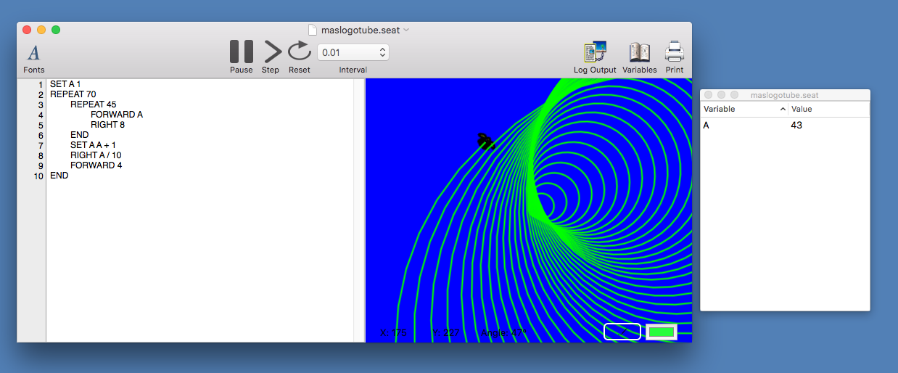

# SeaTurtle

SeaTurtle is a simple [turtle graphics](https://en.wikipedia.org/wiki/Turtle_graphics) scripting language and runtime for macOS built in Swift.

SeaTurtle is reminiscent of (but not compatible with) the Logo programming language environments popular in elementary schools in the '80s and early '90s.

## Scripting Language

The current version of the scripting language supports the following commands:

`RIGHT N`
Turn the turtle N degrees to the right.

`LEFT N`
Turn the turtle N degrees to the left.

`FORWARD N`
Move the turtle N pixels forward.

`BACKWARD N`
Move the turtle N pixels backward.

`SUB NAME`
Declare a subroutine named NAME.

`REPEAT N`
Declare a loop that iterates N times.

`IF BOOLEAN_EXPRESSION`
Start an if statement. The boolean expression can be a single comparison using =, !=, <, <=, >, or >=.

`END`
End a subroutine declaration, if statement, or loop.

`SET X N`
Set a variable named X to value N.

`CALL NAME`
Call a subroutine named NAME.

`HOME`
The turtle will return to its starting position without drawing a line.

`PENUP`
The turtle will still move but won't leave lines beneath it.

`PENDOWN`
The turtle will draw lines beneath it as it moves.

`COLOR N`
Change the color of the lines the turtle draws. If X is 0 it will be yellow, 1 orange, 2, red, 3 magenta, and anything else green.

`PRINT Expression or "String"`
SeaTurtle can log to an output window. The print statement can take a mathematical expression or a string in double quotes. Strings can have variable names after a dollar sign, as in `$N` to interpolate the variables into the string.

All numbers must be integers. All subroutine and variable names must start with a letter. In the above, N can be an integer literal, previously declared variable, or arithmetic expression using the operators `+`, `-`, `*`, `/`, `^`, and parenthesis `( )`. For the context-free grammar of SeaTurtle, see the file `cfg.txt`. See some sample scripts in the directory `SeaTurtle Scripts`.

Comments start with a semicolon (`;`) and end at the end of the line. Once a semicolon is hit, the rest of the line will not be processed.

## Script Files
Script files are just UTF-8 encoded plain text files with SeaTurtle commands. They have the extension `.seat`.

## Implementation

The files that compose the simple lexer, parser, and interpreter are in the directory `Sources`. The main macOS app is document-based and built using Storyboards, Cocoa Bindings, and Sprite Kit.

## Future Direction

Checkmarks indicate this item is currently being worked on.

The SeaTurtle scripting language will hopefully get:

- [ ] Random Numbers

And the SeaTurtle runtime environment should have:

- [ ] Syntax Highlighting/Coloring
- [ ] Printing support (both scripts and turtle graphics images)
- [ ] Turtle graphics picture exports
- [ ] A Tutorial
- [ ] Built-in Examples

## Authorship and License

SeaTurtle is written by David Kopec and released under the GNU GPL Version 3.

## Contributing

Contributors should know that I plan to sell an inexpensive commercial version of SeaTurtle on the Mac App Store, and should be comfortable with their contributions being used by me for-profit. All contributions to SeaTurtle must be released under the GPL and copyright must be assigned to me as the creator of SeaTurtle. This is laid out in the pull-request template. This is to ensure no ambiguity ([see FSF](https://www.gnu.org/licenses/gpl-faq.en.html#AssignCopyright) for more information on the copyright assignment issue.
